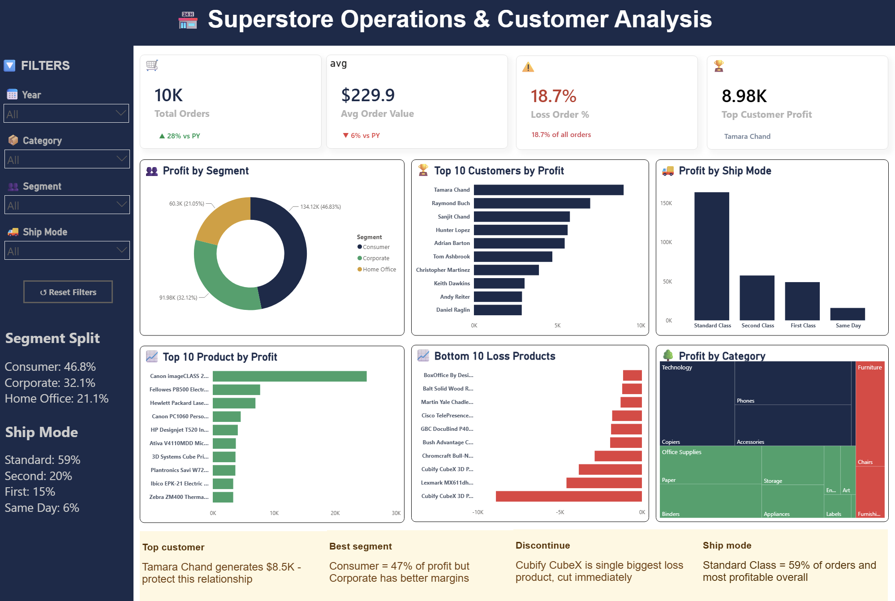
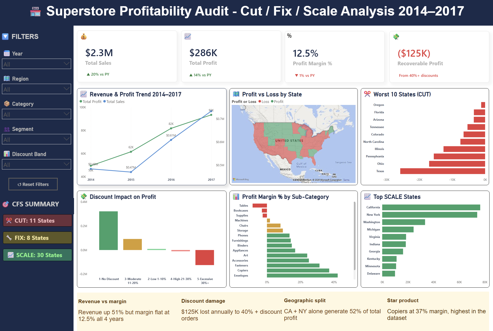

# 🏬 Superstore Power BI Analysis

An end-to-end Power BI project analyzing the [Superstore Dataset](https://www.kaggle.com/datasets/vivek468/superstore-dataset-final) (Kaggle) — covering **sales operations, customer profitability, and a Cut/Fix/Scale profitability audit** across 2014–2017.

The project contains two dashboards:

1. **Operations & Customer Analysis** — orders, customers, shipping, and product-level profit performance.
2. **Profitability Audit (Cut/Fix/Scale)** — a state-level and sub-category profitability audit identifying where to cut losses, fix margins, or scale investment.

---

## 📊 Dashboard 1: Operations & Customer Analysis



**Key metrics:**
- **10K** Total Orders (▲28% vs PY)
- **$229.9** Avg Order Value (▼6% vs PY)
- **18.7%** Loss Order %
- **$8.98K** Top Customer Profit (Tamara Chand)

**Visuals included:**
- Profit by Segment (Consumer / Corporate / Home Office)
- Top 10 Customers by Profit
- Profit by Ship Mode
- Top 10 Products by Profit
- Bottom 10 Loss-Making Products
- Profit by Category (Treemap)

**Key insights:**
- Consumer segment drives 47% of total profit, but Corporate has better margins.
- Cubify CubeX is the single biggest loss-making product — flagged for discontinuation.
- Standard Class shipping accounts for 59% of orders and is the most profitable shipping mode.

---

## 📉 Dashboard 2: Profitability Audit — Cut / Fix / Scale (2014–2017)



**Key metrics:**
- **$2.3M** Total Sales (▲20% vs PY)
- **$286K** Total Profit (▲14% vs PY)
- **12.5%** Profit Margin (▼1% vs PY)
- **($125K)** Recoverable Profit lost to 40%+ discounts

**Visuals included:**
- Revenue & Profit Trend (2014–2017)
- Profit vs Loss by State (Map)
- Worst 10 States (Cut candidates)
- Discount Impact on Profit (by discount band)
- Profit Margin % by Sub-Category
- Top Scale States (Fix/Grow candidates)

**CFS Summary:**
- ✂️ **Cut:** 11 states operating at a loss
- 🔧 **Fix:** 8 states with recoverable margin issues
- 📈 **Scale:** 30 states performing well and worth further investment

**Key insights:**
- Revenue grew 51% over four years, but margin stayed flat at 12.5%.
- $125K is lost annually to orders discounted 40% or more.
- California + New York alone generate 52% of total profit.
- Copiers have the highest margin in the dataset at 37%.

---

## 🗂️ Repository Structure

```
Superstore-PowerBI-Analysis/
│
├── Superstore.pbix                              # Main Power BI project file
├── README.md                                     # Project documentation (this file)
├── Images/
│   ├── Superstore_Operations___Customer_Analysis.png
│   └── Superstore_Profitability_Audit.png
└── data/
    └── Superstore.csv                # Raw dataset (source: Kaggle)
```

---

## 🧰 Tools Used

- **Power BI Desktop** — data modeling, DAX measures, and dashboard design
- **Power Query** — data cleaning and transformation
- **DAX** — calculated columns and measures (profit margin, discount bands, YoY comparisons, CFS classification)

---

## 📁 Data Source

This project uses the **Superstore Dataset** from Kaggle:
🔗 [https://www.kaggle.com/datasets/vivek468/superstore-dataset-final](https://www.kaggle.com/datasets/vivek468/superstore-dataset-final)

The raw CSV (`data/Superstore.csv`) is included in this repo for convenience.

To reproduce this project:
1. Open `Superstore.pbix` in Power BI Desktop.
2. If Power BI can't locate the data automatically, update the data source path to point to `data/Superstore.csv` on your machine (**Home → Transform Data → Data Source Settings → Change Source**).
3. Refresh the data (**Home → Refresh**).

---

## 🚀 How to Use This Project

1. Install [Power BI Desktop](https://www.microsoft.com/en-us/power-platform/products/power-bi/desktop) (free, Windows only).
2. Clone or download this repository.
3. Open `Superstore.pbix`.
4. Explore the report using the filters on the left (Year, Category, Segment, Region, Ship Mode, Discount Band).

---

## 👤 Author

**Sheena**
📧 sheena.charaya@gmail.com | 🔗 [LinkedIn](https://linkedin.com/in/sheena-charaya)

---

## 📜 License

This project is for portfolio/educational purposes. The dataset belongs to its original Kaggle contributor; please refer to the [Kaggle dataset page](https://www.kaggle.com/datasets/vivek468/superstore-dataset-final) for its license terms.
